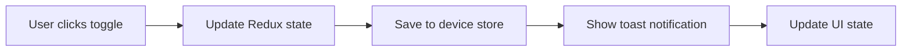
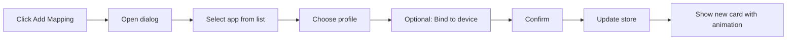
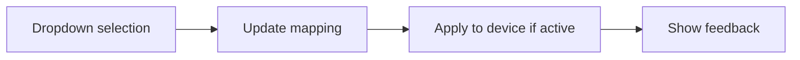

# App Profiles UI Implementation Plan

## File Structure
```
src/components/panes/app-profiles/
├── index.tsx                    # Main container component
├── app-profiles.styles.ts       # All styled components
├── components/
│   ├── AppProfilesHeader.tsx    # Header with toggle and status
│   ├── NavigationTabs.tsx       # Tab navigation component
│   ├── AppMappingCard.tsx       # Individual app mapping card
│   ├── ProfileCard.tsx          # Configuration profile card
│   ├── SearchBar.tsx            # Search/filter component
│   ├── EmptyState.tsx          # Empty state component
│   └── QuickActions.tsx        # Action buttons component
├── dialogs/
│   ├── CreateMappingDialog.tsx  # Add new mapping dialog
│   ├── EditProfileDialog.tsx    # Edit profile dialog
│   └── ConfirmDialog.tsx       # Confirmation dialog
└── hooks/
    ├── useAppProfiles.ts        # Custom hook for app profiles logic
    └── useSearch.ts             # Search/filter logic
```

## Component Specifications

### 1. AppProfilesHeader Component
```typescript
interface AppProfilesHeaderProps {
  enabled: boolean;
  currentApp: {bundleId: string; name: string} | null;
  onToggle: () => void;
}

Features:
- Large toggle switch with smooth animation
- Current app display with icon
- Status indicator (active/inactive)
- Help tooltip with usage instructions
```

### 2. AppMappingCard Component
```typescript
interface AppMappingCardProps {
  bundleId: string;
  appName: string;
  profile: string;
  deviceVpid?: number;
  isActive: boolean;
  availableProfiles: string[];
  onProfileChange: (profile: string) => void;
  onEdit: () => void;
  onDelete: () => void;
}

Features:
- App icon (if available)
- Dropdown for profile selection
- Device binding indicator
- Quick action buttons on hover
- Active state highlighting
```

### 3. ProfileCard Component
```typescript
interface ProfileCardProps {
  name: string;
  layerCount: number;
  macroCount: number;
  lastModified?: Date;
  isDefault: boolean;
  isActive: boolean;
  onApply: () => void;
  onEdit: () => void;
  onDuplicate: () => void;
  onDelete: () => void;
}

Features:
- Profile statistics display
- Action buttons with icons
- Active/default badges
- Hover effects
```

## Styled Components Design

### Theme Extensions
```typescript
// app-profiles.styles.ts
import styled, { css, keyframes } from 'styled-components';

// Animations
const fadeIn = keyframes`
  from { opacity: 0; transform: translateY(-10px); }
  to { opacity: 1; transform: translateY(0); }
`;

const slideIn = keyframes`
  from { transform: translateX(-100%); }
  to { transform: translateX(0); }
`;

// Container Components
export const Container = styled.div`
  display: flex;
  flex-direction: column;
  height: 100%;
  padding: 24px;
  gap: 24px;
  overflow: hidden;
`;

export const Header = styled.header`
  display: flex;
  justify-content: space-between;
  align-items: center;
  padding: 20px;
  background: var(--bg_menu);
  border-radius: 12px;
  box-shadow: 0 2px 8px rgba(0, 0, 0, 0.1);
  animation: ${fadeIn} 0.3s ease-out;
`;

export const Card = styled.div<{ isActive?: boolean }>`
  background: var(--bg_menu);
  border: 2px solid ${props => props.isActive ? 'var(--color_accent)' : 'var(--bg_control)'};
  border-radius: 12px;
  padding: 20px;
  transition: all 0.3s ease;
  cursor: pointer;
  
  &:hover {
    transform: translateY(-2px);
    box-shadow: 0 4px 12px rgba(0, 0, 0, 0.15);
    border-color: var(--color_accent);
  }
`;

export const Grid = styled.div`
  display: grid;
  grid-template-columns: repeat(auto-fill, minmax(350px, 1fr));
  gap: 20px;
  overflow-y: auto;
  padding: 4px;
`;
```

## User Interaction Flows

### 1. Enable/Disable App Profiles


### 2. Add New App Mapping


### 3. Quick Profile Switch


## Implementation Priority

### Phase 1: Core UI Components (Week 1)
1. Create new file structure
2. Implement styled components
3. Build AppProfilesHeader
4. Create basic Card components
5. Set up NavigationTabs

### Phase 2: Functionality (Week 2)
1. Integrate with existing Redux store
2. Implement search/filter
3. Add dialog components
4. Connect all interactions
5. Add animations

### Phase 3: Polish & Testing (Week 3)
1. Add loading states
2. Implement error handling
3. Add keyboard navigation
4. Test accessibility
5. Performance optimization

## Success Metrics
- Reduced time to add/edit mappings (target: 50% reduction)
- Improved visual clarity (user feedback)
- Zero accessibility issues
- Smooth animations (60fps)
- Search functionality working instantly

## Technical Considerations
- Use React.memo for performance
- Implement virtual scrolling for large lists
- Add debouncing for search
- Use optimistic updates for better UX
- Ensure backwards compatibility with existing data